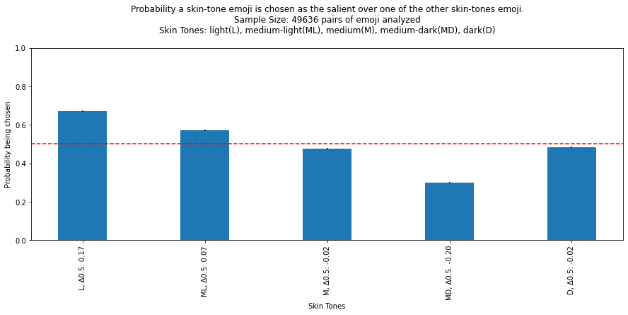
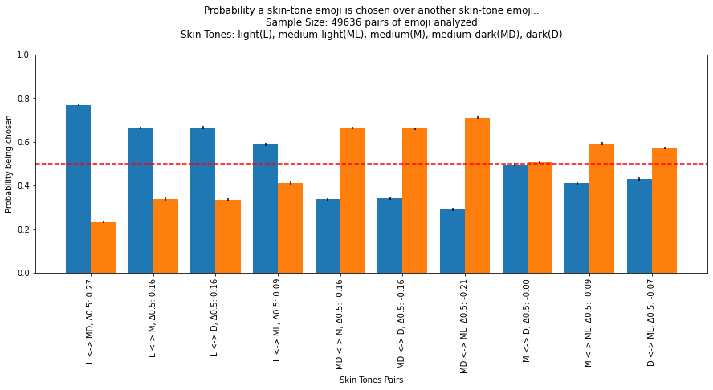

# Twitter Crop Emoji Bias

The Twitter app for Android allows users to edit images before being tweeted, allowing users to apply filters, add an alternative description or simply add stickers.
When a user wants to add a sticker, the application asks the user to choose from a fixed set of images developed by Twitter itself named "Twemoji" [1].

When a user adds a sticker from the app, its content is rasterized on the original image, and the final result is then posted to the user's timeline. 
Since the emoji is rasterized, its content is part of the image itself therefore it is visible to backend algorithms (e.g: by the cropping algorithm) that may behave incorrectly because of this new content. Furthermore, the Twemoji set contains many versions of the same person-related image (e.g: a smiling face) representing the same content under many skin tones (light, medium-light, medium, medium-dark, dark) trying to be fair representing all skin tones present in the world. Therefore an incorrect behavior of an algorithm related to a specific set of emojis may be interpreted as racial discrimination, causing harm to users or to Twitter itself.

The notebook `emoji-bias.ipynb` demonstrate that when asked to the [image-crop-algorithm](https://github.com/twitter-research/image-crop-analysis) used by Twitter [2] to choice wich emoji to crop out of two, it is biased towards light skin tone emoji. In particular, the following chart, shows how light skin tone emoji have +17% probability to be chosen more than the expected baseline, and that in general the more lighter the emoji the more likely is to be picked:

**Metodology**: all Twitter emoji have been downloaded from [2] filtering only the ones with specified skin tone, then random "vertical collages" of pair of emoji have been syntethized (~50000) and processed by the cropping algorithm. Results were analyzed finding the probability that each skin tone is preferred versus the other and using confidence intervals to assest significance.

**Note**: 
- I've noticed that emoji are rasterized when posted but I can't be sure that the input to the automatic cropping was the image+emoji since it is now disabled [3].
- This analysis is not based on real data and it is likely that the algorithm will prefer natural looking images (e.g: real faces) rather than emoji.
- This analysis lacks other experiments to understand _why_ this happen, but it is likely that light-skin-tone images have a better contrast. This may explain why dark-skin-tone are preferred versus medium-skin-tone.
- The risk of harm is extremely low, but can be interesting to reason if it is right to consider stickers in the process of saliency detection or apply them later.

## Self Evaluation

* Type of Harm: unintentional underrepresentation (20 points), but it can also be intentional since the only tool required is the native client.
* Multiplier Factors:
  - **Damage or impact**: "Low impact on a person’s well-being", "harm is measured along a single axis of identity and disproportionally affects a marginalized community" (avg (1, 1.2) = 1.15)
  - **Affected Users**: This may impact any user of Twitter (Affective User Score = 1.2)
  - **Likelihood or Exploitability**: Extremely rare but it could occur on Twitter (Likelihood = 1.0)
  - **Exploitability**: No programming skills are needed; automated exploit tools exist (Exploitability = 1.3)
  - **Clarity**: The submission included detailed instructions and notebooks but lacks convincing evidence regarding the metodology used (Clarity = 1.0)
  - **Justification**: Findings were considered strong but could have been improved by doing better analysis, expecially using data created by the client of twitter rather than synthetized. The submission contained limited details about how harms impacted affected people. (Justification = 1.0)
  - **Creativity**: Did not qualify for additional creativity.
  
  Result: 20 x 1.15 x 1.2 x 1 x 1.3 x 1 x 1 = 35.87
  
  [1]: https://twemoji.twitter.com/
  [2]: https://emojipedia.org/twitter/twemoji-13.1/
  [3]: https://twitter.com/dantley/status/1390040111228723200?s=20
